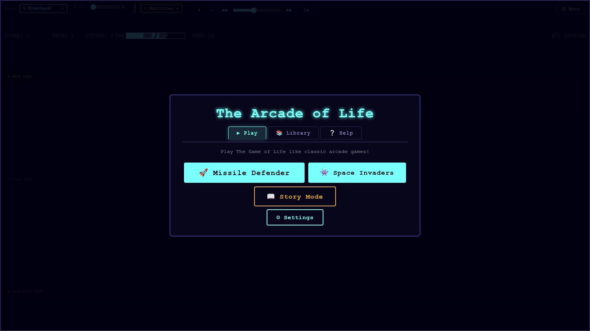
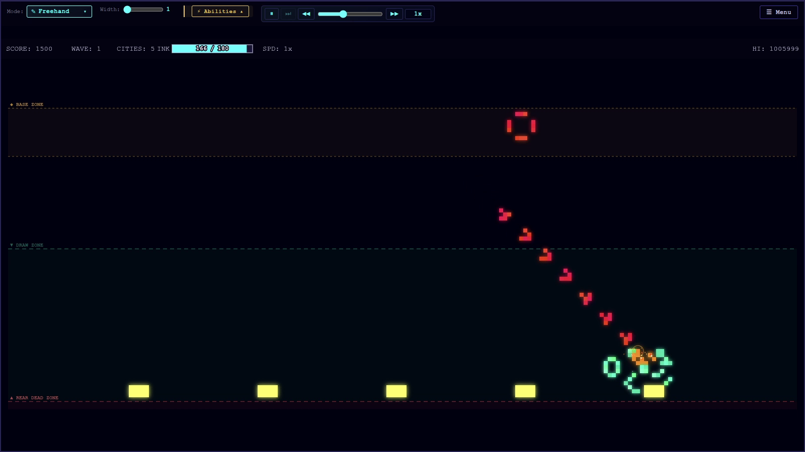
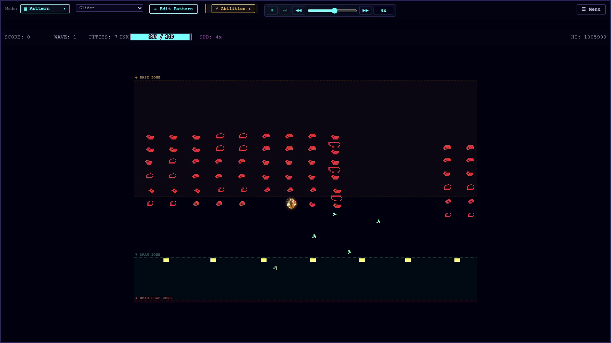
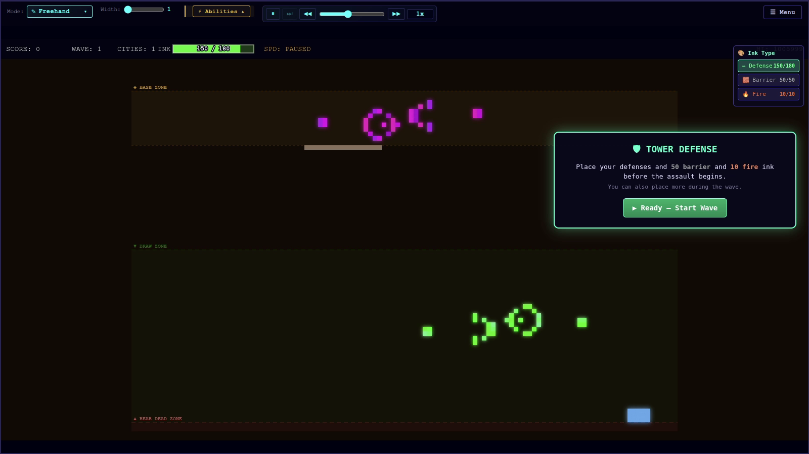
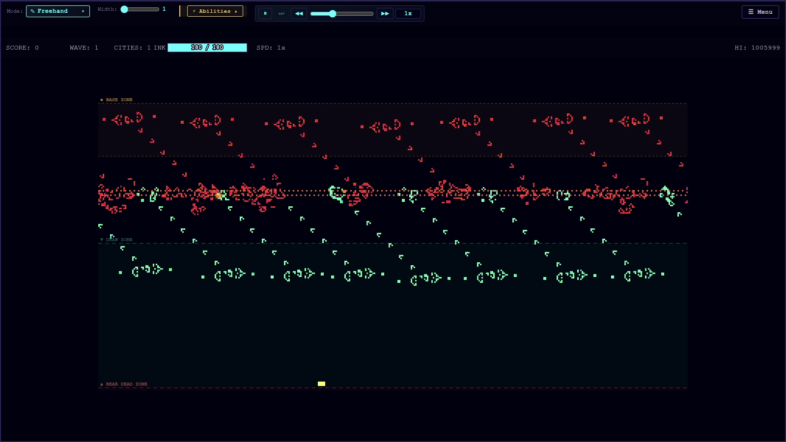
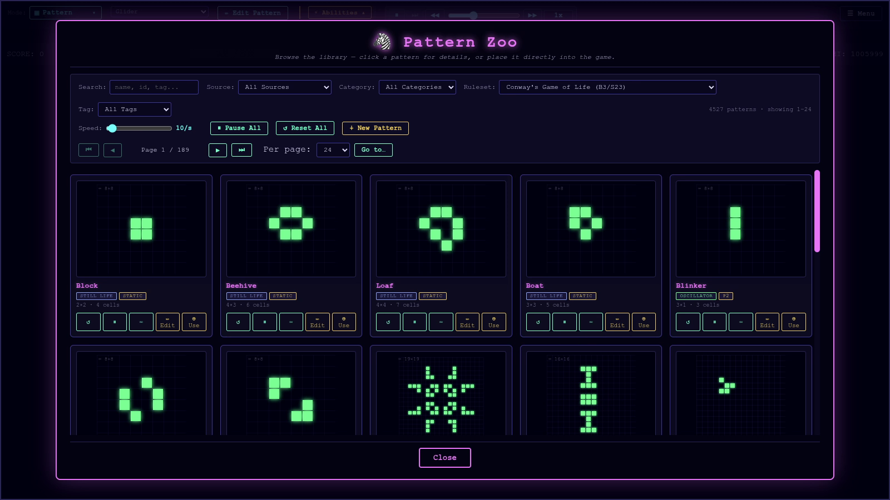
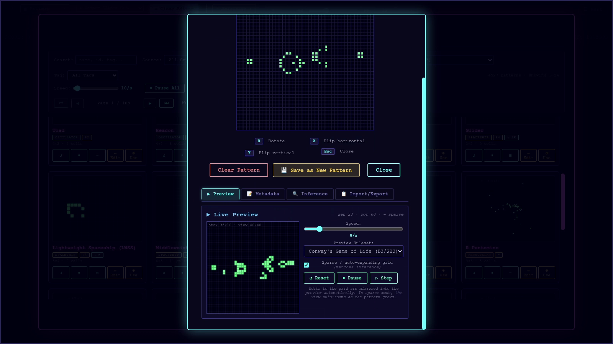
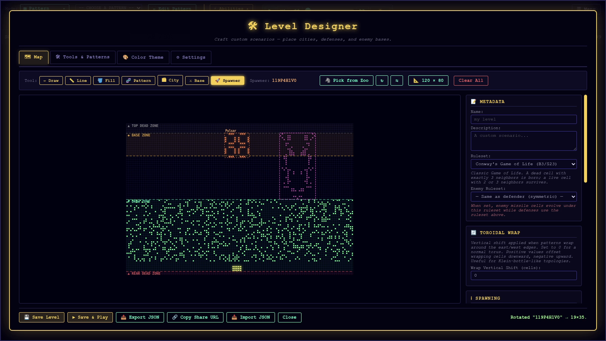
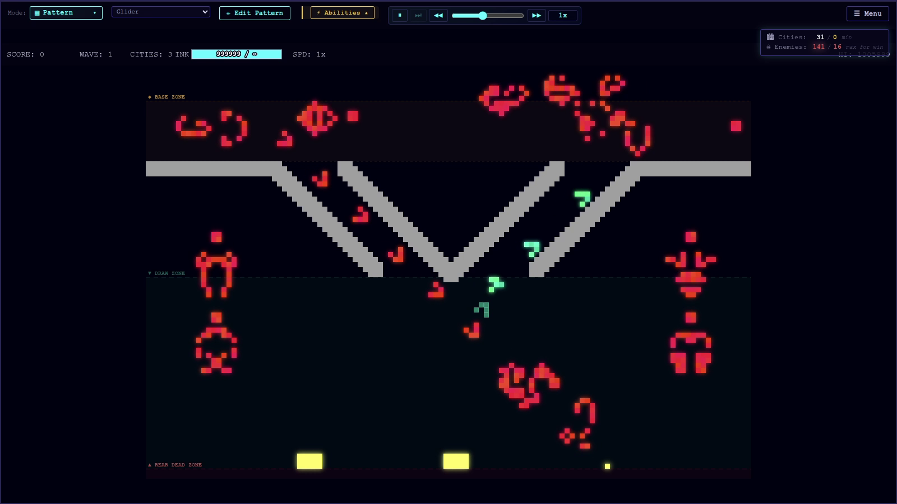
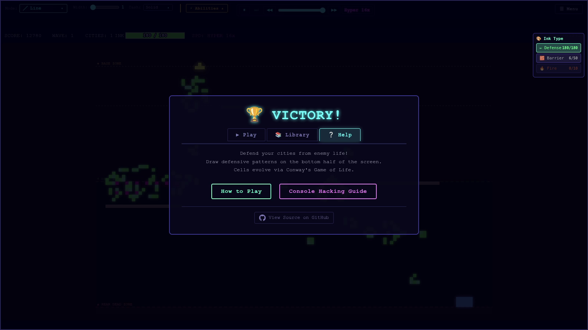

# 🕹️ The Arcade of Life

> **A browser-based arcade game collection powered by Conway's Game of Life — and 50+ other cellular automaton rulesets.
**

Draw defensive patterns that evolve into intercepting structures. Watch glider-based missiles clash with your living
defenses. Explore exotic CA rulesets, design your own levels, and browse hundreds of known Life patterns — all in a
zero-dependency, no-build-step browser app.



---

## 🎮 Game Modes

### 🚀 Missile Defender

Your cities are under attack. Enemy **gliders** descend from above — draw cells of life to intercept them.



- Draw ink in your **defense zone** (lower portion of the grid)
- Your cells evolve according to the active CA ruleset — they grow, spread, and collide with enemy patterns
- Protect your **cities** (blue structures at the bottom) from being destroyed
- Survive all waves to win

> **Tip:** A simple horizontal line evolves into a spreading wave that can intercept multiple gliders at once.
> Experiment with different starting shapes!

---

### 👾 Space Invaders

Classic arcade action, reimagined through cellular automata.



- Enemy **spaceships** descend in formation
- Your drawing tool is pre-loaded with a **glider** — shoot upward to intercept
- Spaceships and gliders annihilate each other on collision
- Clear all waves before they reach the bottom

> **Tip:** Right-click the pattern selector to rotate your glider. Aim ahead of moving targets!

---

### 🏰 Tower Defense Simulator

A puzzle-flavored mode where **placement matters more than reflexes**.



- You are given **Barrier** and **Fire** ink before the simulation starts
- Place barrier tiles to deflect or absorb enemy glider streams
- Place fire tiles (always-alive cells) to create persistent hazards
- Once you commit, the simulation runs — watch your defenses hold or crumble

> **Tip:** Fire tiles need to be "struck" — a passing glider activates them. Place them in the path of enemy fire for
> chain reactions!

---

### 🔥 Fire Line

A spectacular **spectator-friendly** demonstration level.



- Two arrays of **Gosper Glider Guns** face each other across a line of fire tiles
- Glider streams activate the fire tiles, creating a dynamic, evolving battlefield
- You can participate — or just watch the chaos unfold

---

## 🧬 Cellular Automata Mechanics

The Arcade of Life is built on **cellular automata** (CA) — mathematical systems where cells on a grid live or die based
on simple neighbor-counting rules.

### Conway's Game of Life (B3/S23)

The default ruleset. A cell:

- **Born** if it has exactly **3** live neighbors
- **Survives** if it has **2 or 3** live neighbors
- **Dies** otherwise

This produces rich emergent behavior: stable structures, oscillators, and **gliders** — patterns that travel across the
grid.

```
Generation 0    Generation 1    Generation 2    Generation 3
. . . . .       . . . . .       . . . . .       . . . . .
. . ■ . .       . . . . .       . . . . .       . . . . .
. . ■ . .  →    . ■ ■ . .  →    . . ■ . .  →    . ■ . . .
. . ■ . .       . . ■ . .       . ■ ■ . .       . . ■ ■ .
. . . . .       . . . . .       . . . . .       . . . . .
         (Blinker oscillator — period 2)
```

### The Glider — Your Missile

```
. ■ .        . . ■        . . .        . . .
. . ■   →    ■ . ■   →    . ■ ■   →    ■ . ■   → (repeats, shifted)
■ ■ ■        . ■ ■        ■ ■ .        . . ■
```

Gliders travel diagonally across the grid — they are the "missiles" in Missile Defender and the ammunition in Space
Invaders.

### 50+ Supported Rulesets

Switch rulesets mid-game in **Settings → Ruleset**:

| Ruleset         | Notation     | Character                         |
|-----------------|--------------|-----------------------------------|
| Conway's Life   | B3/S23       | Classic gliders, oscillators      |
| HighLife        | B36/S23      | Self-replicating patterns         |
| Day & Night     | B3678/S34678 | Symmetric — dead/alive equivalent |
| Seeds           | B2/S         | Explosive growth, no survival     |
| Brian's Brain   | (3-state)    | Perpetual motion machine          |
| Wireworld       | (4-state)    | Electronic circuit simulation     |
| Langton's Ant   | (TCA)        | Turing-complete ant               |
| ...and 40+ more |              |                                   |

**Exotic engines** include:

- **Time-integrated CA** — cells remember their history
- **Fractional lightcone** — probabilistic neighbor influence
- **Custom neighborhoods** — hexagonal, triangular, extended Moore

---

## 🎨 Drawing & Ink System

### Ink Types

| Ink         | Color        | Behavior                                      |
|-------------|--------------|-----------------------------------------------|
| **Defense** | Blue/Green   | Evolves with CA rules — your living cells     |
| **Enemy**   | Red/Orange   | Evolves with CA rules — hostile cells         |
| **Barrier** | Gray         | Static dead cell — never changes, blocks life |
| **Fire**    | Yellow/White | Static alive cell — always on, spreads heat   |
| **Erase**   | —            | Removes all cells                             |

### Drawing Tools

| Tool            | Description                                   |
|-----------------|-----------------------------------------------|
| ✏️ **Freehand** | Draw with mouse/touch — variable line width   |
| 📏 **Line**     | Straight lines with dash patterns             |
| ⬜ **Rectangle** | Filled or outlined rectangles                 |
| 🔵 **Ellipse**  | Circles and ovals                             |
| 🪣 **Fill**     | Flood fill a region (solid or random density) |
| 🔬 **Pattern**  | Stamp a pattern from the library              |

### Pattern Stamping

Open the **Pattern Zoo** to browse hundreds of known Life patterns:



- Search by name or category (spaceships, oscillators, still lifes, guns...)
- Preview live animation before placing
- Rotate (R) and mirror (X/Y) before stamping
- Edit patterns in the **Pattern Editor**



---

## 🏗️ Level Designer

Build your own levels with the full-featured level designer:



### What You Can Place

| Element            | Description                               |
|--------------------|-------------------------------------------|
| 🏙️ **City**       | Player objective — protect these to win   |
| 🔫 **Base**        | Enemy structure — destroy to score points |
| 🌀 **Spawner**     | Repeatedly spawns a chosen pattern        |
| 🎨 **Ink regions** | Pre-fill areas with any ink type          |

### Workflow

1. **Choose a drawing tool** from the toolbar
2. **Select ink type** (Defense, Enemy, Barrier, Fire, Erase)
3. **Paint the grid** — use fill for large areas, freehand for detail
4. **Place entities** — cities, bases, spawners
5. **Configure spawners** — pick a pattern from the zoo, set rotation
6. **Name your level** and **Save**
7. **Play immediately** or share the JSON

### Spawner Patterns

Spawners can emit any pattern from the library on a configurable interval. Popular choices:

- **Glider** — diagonal missile
- **LWSS** (Lightweight Spaceship) — horizontal missile
- **Gosper Glider Gun** — continuous glider stream
- **R-pentomino** — chaotic growth cloud

---

## 🗺️ Level Catalog

The game ships with curated levels showcasing different mechanics:

| Level          | Mode             | Highlights             |
|----------------|------------------|------------------------|
| **Pillbox**    | Missile Defender | Classic intro level    |
| **Firewalls**  | Missile Defender | Barrier-conduit puzzle |
| **Mothership** | Space Invaders   | Boss wave finale       |
| **Petri**      | Free Play        | Sandbox CA exploration |
| **Fire Line**  | Spectator        | Glider gun light show  |
| **TDS**        | Tower Defense    | Pre-placement puzzle   |
| **Invaders**   | Space Invaders   | Formation waves        |

---

## 🖥️ Interface & Controls

### Keyboard Shortcuts

| Key       | Action                      |
|-----------|-----------------------------|
| `Space`   | Pause / Resume              |
| `→` / `L` | Step one generation         |
| `+` / `-` | Speed up / slow down        |
| `R`       | Rotate selected pattern     |
| `X`       | Mirror pattern horizontally |
| `Y`       | Mirror pattern vertically   |
| `Z`       | Undo last draw              |
| `Escape`  | Open menu / cancel tool     |
| `1`–`9`   | Select drawing tool         |
| `G`       | Toggle grid lines           |
| `F`       | Toggle FPS display          |

### Mouse / Touch

| Action                       | Result                           |
|------------------------------|----------------------------------|
| **Left drag**                | Draw with current tool           |
| **Right click**              | Rotate pattern (in pattern tool) |
| **Scroll wheel**             | Zoom in/out                      |
| **Middle drag**              | Pan the view                     |
| **Pinch** (mobile)           | Zoom                             |
| **Two-finger drag** (mobile) | Pan                              |

---

## ⚙️ Settings

Access via the **⚙️ Settings** button or `Escape` menu:

### Gameplay

- **Ruleset** — switch CA rules (Conway, HighLife, Seeds, etc.)
- **Grid topology** — Square / Hexagonal / Triangular
- **Simulation backend** — CPU (default) or WebGL2 GPU
- **Wave difficulty** — missile count, speed, pattern complexity

### Visual

- **Cell size** — zoom level
- **Color theme** — multiple palettes
- **VFX toggles** — particles, shockwaves, screen shake, glow
- **Grid lines** — on/off

### Advanced

- **Ink drying** — drawn cells age and fade (cosmetic)
- **Age limit** — cells die after N generations (adds pressure)
- **Anchor cells** — drawn cells resist CA death (easier mode)
- **Return fire** — your cells can spawn counter-missiles

---

## 🎆 Visual Effects

The renderer features a full VFX suite (all toggleable):

| Effect                 | Trigger                                  |
|------------------------|------------------------------------------|
| 💥 **Particle bursts** | Explosions, missile impacts              |
| 🌊 **Shockwave rings** | Expanding circles on collision           |
| 💬 **Floating text**   | "RETURN FIRE!", "CITY HIT!", "RICOCHET!" |
| 📳 **Screen shake**    | Intensity-scaled impact feedback         |
| ✨ **Cell glow**        | Neon rendering for missile cells         |
| 🎨 **Draw-zone tint**  | Subtle playable-region highlight         |
| 📣 **Wave banners**    | Dramatic chapter intro animations        |

All effects use **adaptive throttling** — they automatically scale back during heavy simulation load to maintain frame
rate.

```js
// Check VFX performance stats in the browser console:
cheats.vfxStats()
```

---

## 🔬 Pattern Zoo

Browse the full **LifeWiki dataset** of known Conway's Life patterns:


### Categories

- 🛸 **Spaceships** — patterns that travel (gliders, LWSSs, HWSSs, Copperheads...)
- 🔄 **Oscillators** — patterns that repeat (blinkers, pulsars, pentadecathlons...)
- 🧱 **Still Lifes** — stable patterns (blocks, beehives, loaves...)
- 🔫 **Guns** — patterns that emit spaceships (Gosper Glider Gun...)
- 🌱 **Methuselahs** — long-lived chaotic patterns (R-pentomino, Acorn...)
- 🔁 **Puffers** — moving patterns that leave debris
- 🚂 **Rakes** — moving patterns that emit spaceships

### Pattern Editor

Edit any pattern before placing it:


- Click cells to toggle them
- Rotate and mirror
- Run a live preview simulation
- Save as a custom pattern

---

## 🧪 Console Hacking

The game exposes a rich console API for power users and developers. Open browser DevTools (`F12`) and try:

```js
// === Simulation Control ===
cheats.setRule('B36/S23')        // Switch to HighLife
cheats.setRule('B2/S')           // Switch to Seeds (explosive!)
cheats.setSpeed(10)              // Set simulation speed
cheats.step(100)                 // Advance 100 generations

// === Grid Manipulation ===
cheats.fillRandom(0.3)           // 30% random fill
cheats.clear()                   // Clear all cells
cheats.placePattern('glider', 10, 10)  // Place a glider at (10,10)
cheats.placePattern('gosper_glider_gun', 5, 5)

// === Game State ===
cheats.addScore(9999)            // Add score
cheats.skipWave()                // Skip to next wave
cheats.godMode()                 // Cities can't be destroyed
cheats.killAll()                 // Destroy all enemy cells

// === VFX & Debug ===
cheats.vfxStats()                // VFX performance report
cheats.showGrid(true)            // Toggle grid overlay
cheats.fps()                     // Show FPS counter

// === Pattern Capture ===
cheats.captureRegion(x, y, w, h) // Export region as RLE
cheats.importRLE('bo$2bo$3o!')   // Import RLE string
```

See the full API in **Help → Console Guide** (in-game) or `console_guide.md`.

---

## 🏗️ Architecture

```
src/
  main.js              Game orchestrator + console API
  config.js            All tunable constants + game mode presets
  grid.js              Cell storage + draw-zone helpers
  simulation.js        Conway logic + collision + age + return-fire
  renderer.js          Canvas rendering + VFX (particles, shockwaves, floaters)
  input.js             Mouse/touch with line width + dash + ink drying
  hud.js               Score, wave, ink, high score
  gameState.js         State machine
  settings.js          Settings panel + persistence + profiles
  audio.js             Procedural synth SFX (Web Audio API)
  drawTools.js         Tool switcher + pattern editor overlay
  pwa.js               Service worker + install prompt + offline support
  story.js             Story mode engine
  patternZoo.js        Pattern library browser
  patternCapture.js    Capture grid regions as patterns
  levelDesigner.js     Custom level editor
  levels.js            Level storage
  levelCatalog.js      Curated level loader
  topology.js          Square / hex / tri grid topologies
  abilities.js         Free-play ability manager
  logger.js            Centralized leveled logger
  storage.js           localStorage safety wrappers
  guide.js             Markdown guide overlay

  rules/
    ruleset.js         CA rule registry, B/S parser, compiler
    neighborhoods.js   Custom neighborhood definitions
    extraRulesets.js   Built-in rule library (Conway, HighLife, etc.)
    exoticEngines.js   TCA, time-integrated, fractional lightcone
    exoticRulesets.js  Pre-built exotic rule definitions
    index.js           Aggregator + auto-registration

  patterns/
    library.js         Pattern registry with metadata
    index.js           Public API + legacy preset map
    categories.js      CATEGORY constants
    parsers.js         RLE / .cells file format parsers
    inferMetadata.js   Auto-classify patterns via simulation
    lifewikiImporter.js Bulk-import LifeWiki datasets

  sim/
    cpuBackend.js      Tight CPU neighbor-counting backend
    gpuBackend.js      WebGL2 backend for very large grids
    hashlife.js        Memoization for static defense regions
    cellCounts.js      Region-aware cell counting
    tickHelpers.js     Shared tick logic (age limits, anchors, swaps)
    lifeSim.js         Pure sparse-set Life simulator for patterns

  entities/
    cities.js          City placement and tracking
    missiles.js        Wave spawning + designed bases/spawners
    defenses.js        Ink management

levels/                Shipped curated levels (JSON)
test/                  Test suites (plain Node.js assert)
sw.js                  Service worker (offline caching)
manifest.json          PWA manifest
```

### Design Principles

| Principle             | Implementation                                         |
|-----------------------|--------------------------------------------------------|
| **Zero dependencies** | Pure ES6 modules, no build step                        |
| **Modular**           | Each subsystem owns its state, exposes a focused API   |
| **Hackable**          | Live config, console cheats, runtime ruleset switching |
| **Topology-agnostic** | Square, hex, and triangular grids                      |
| **Backend-pluggable** | CPU (default) or WebGL2 simulation                     |
| **Defensive**         | Errors in one subsystem don't crash the game           |
| **Offline-first**     | Full PWA with service worker caching                   |

---

## 🚀 Quick Start

### Play in Browser

```bash
# Just open the file — no install needed
open index.html
```

Or visit the hosted version: **[https://aol.cognotik.com](https://aol.cognotik.com)**

### Local Development Server

```bash
npm run serve
# → http://localhost:8080
```

A local server enables service workers, fetch APIs, and PWA install.

### Install as PWA

1. Open in Chrome / Edge / Safari
2. Click the **install icon** in the address bar
3. (Mobile) tap **"Add to Home Screen"**
4. Launch like any native app — works fully offline

---

## 🧪 Testing

```bash
npm test                    # Run all suites
npm run test:patterns       # Pattern library
npm run test:rules          # Ruleset parsing & compilation
npm run test:neighborhoods  # Custom neighborhoods
npm run test:exotic         # Exotic engines
npm run test:simulation     # Pattern evolution
npm run test:sim-engine     # CPU backend & hashlife
npm run test:wrap           # Toroidal wrap shift
npm run test:grid           # Grid utilities
npm run test:topology       # Hex/tri topologies
npm run test:parsers        # RLE/cells file parsers
npm run test:infer          # Metadata inference
```

Tests use plain Node.js `assert` — no framework required.

### Linting & Formatting

```bash
npm run lint          # ESLint
npm run lint:fix      # Auto-fix issues
npm run format        # Prettier
npm run format:check  # Check without writing
npm run validate      # lint + format:check + test
```

---

## 🤝 Contributing

The codebase is intentionally hackable. Common extension points:

### Add a Ruleset

```js
// src/rules/extraRulesets.js
registerRuleset({
  name: 'My Rule',
  notation: 'B34/S45',
  description: 'Born with 3-4 neighbors, survives with 4-5',
});
```

### Add a Pattern

```js
// src/patterns/library.js
registerPattern({
  name: 'My Pattern',
  rle: 'bo$2bo$3o!',
  category: CATEGORY.SPACESHIP,
  description: 'A custom glider variant',
});
```

### Add a Game Mode

```js
// src/config.js — extend GAME_MODE_PRESETS
GAME_MODE_PRESETS.myMode = {
  ruleset: 'B36/S23',
  waveConfig: { ... },
  hudConfig: { ... },
};
```

### Add a Cheat

```js
// src/main.js — extend _makeCheats()
cheats.myCheat = () => {
  grid.fillRandom(0.5);
  console.log('Chaos unleashed!');
};
```

### Add a Level

1. Open the **Level Designer** in-game
2. Design your level
3. Save → copy the JSON
4. Add to `levels/` and register in `levels/index.json`

Open a PR with tests for new features!

---

## 🌐 Browser Compatibility

| Browser          | Status        | Notes                |
|------------------|---------------|----------------------|
| Chrome / Edge    | ✅ Recommended | Full feature support |
| Firefox          | ✅ Supported   | Full feature support |
| Safari (desktop) | ✅ Supported   | Full feature support |
| Safari (iOS)     | ✅ Supported   | Touch controls work  |
| Chrome (Android) | ✅ Supported   | Touch + PWA install  |

**Required APIs:**

- ES6 modules
- Canvas 2D
- localStorage

**Optional APIs (graceful degradation):**

- WebGL2 — GPU simulation backend (large grids)
- Web Audio API — procedural SFX
- Service Worker — offline PWA support

---

## 📸 Screenshots

|                                                |                                                  |
|------------------------------------------------|--------------------------------------------------|
|            |  |
| *Missile Defender — wave in progress*          | *Space Invaders mode*                            |
|  |  |
| *Tower Defense — pre-placement phase*          | *Level Designer*                                 |
|      |  |
| *Pattern Zoo — LifeWiki browser*               | *Pattern Editor*                                 |
|          |            |
| *Help & Console Guide*                         | *Main Menu*                                      |

---

## 📄 License

LGPL 3.0 — see LICENSE file.

---

*Built with ❤️ and cellular automata. No frameworks were harmed in the making of this game.*